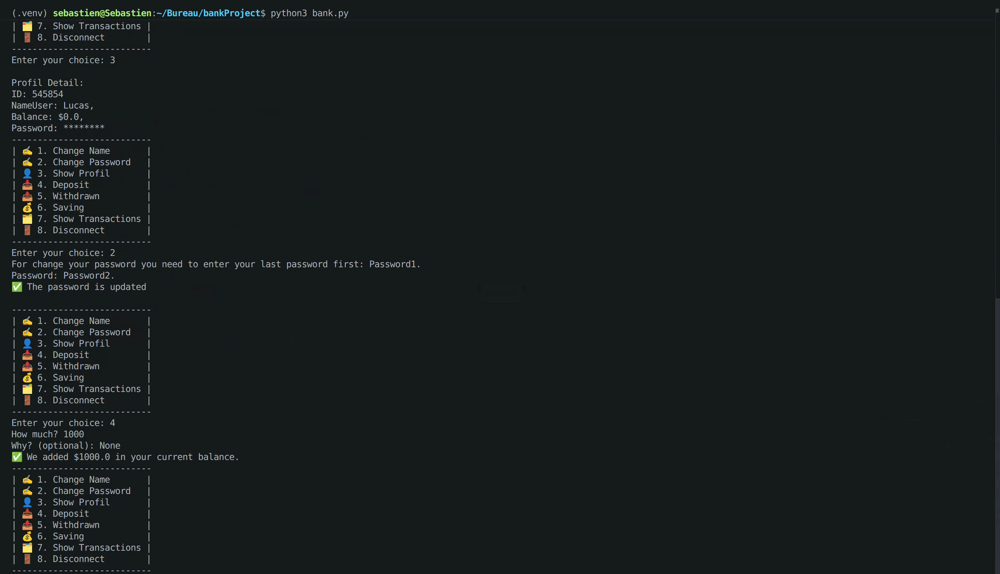
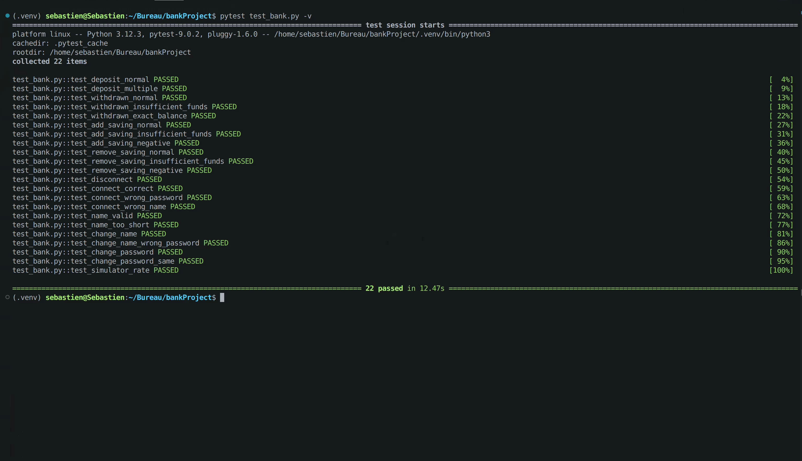

# 🏦 SXBank

A command-line banking application built in Python, created by **Sébastien Xia**.

---

## 📋 Description

SXBank is a terminal-based banking system that allows users to create an account, manage their balance, handle a savings account, and track all transactions. Passwords are securely hashed using **bcrypt**.

---

## 🎬 View

### Application View



### Tests View



---

## ✨ Features

- 🔐 Secure account creation with bcrypt password hashing
- 💰 Deposit and withdrawal with balance validation
- 🏦 Savings account with transfer between accounts
- 📈 Interest rate simulator (1.5% per year)
- 🗂️ Transaction history saved to `transactions.txt`
- ✏️ Change username and password securely
- 🔒 Connect / Disconnect system

---

## 🛠️ Installation

**Clone the repository**
```bash
git clone https://github.com/your-username/sxbank.git
cd sxbank
```

**Install dependencies**
```bash
pip install bcrypt
pip install pytest        # For tests only
pip install types-bcrypt  # For VS Code type hints only
```

---

## 🚀 Usage

```bash
python bank.py
```

---

## 🧪 Tests

Run all tests with pytest :

```bash
pytest test_bank.py -v
```

**Test coverage :**

| Category | Tests |
|---|---|
| Deposit | Normal, multiple deposits |
| Withdrawn | Normal, insufficient funds, exact balance |
| Saving | Add, remove, edge cases |
| Connect / Disconnect | Correct credentials, wrong password, wrong name |
| Name / Password | Validation, change, wrong password |
| Simulator | Interest rate calculation |

---

## 📁 Project Structure

```
sxbank/
│
├── bank.py          # Main application
├── test_bank.py     # Unit tests
├── transactions.txt # Auto-generated transaction log
└── README.md
```

---

## 🔐 Security

- Passwords are **never stored in plain text**
- bcrypt hashing with **salt** (cost factor 12)
- Password **never recoverable**, only verifiable

---

## 📦 Dependencies

| Package | Usage |
|---|---|
| `bcrypt` | Password hashing |
| `re` | Input validation (regex) |
| `datetime` | Transaction timestamps |
| `random` | Account ID generation |
| `pytest` | Unit testing |

---

## 👤 Author

**Sébastien Xia** — L1 Informatique, Université Paris Cité

---

## 📄 License

This project is for educational purposes. 
MIT LICENCE
